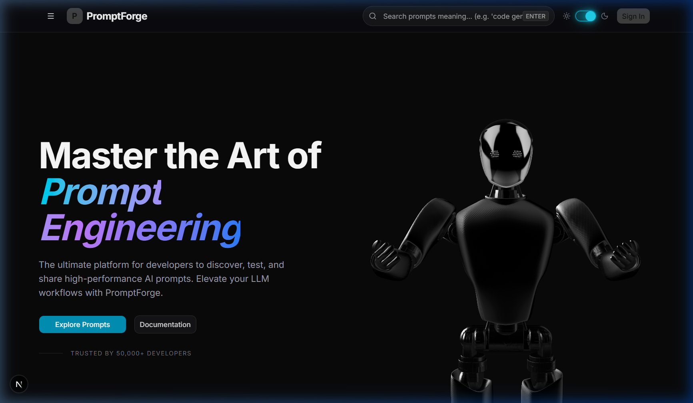
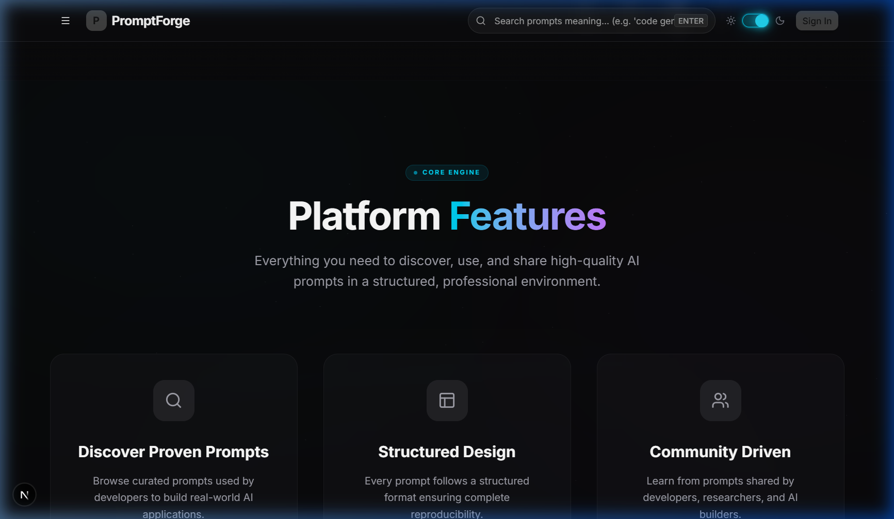
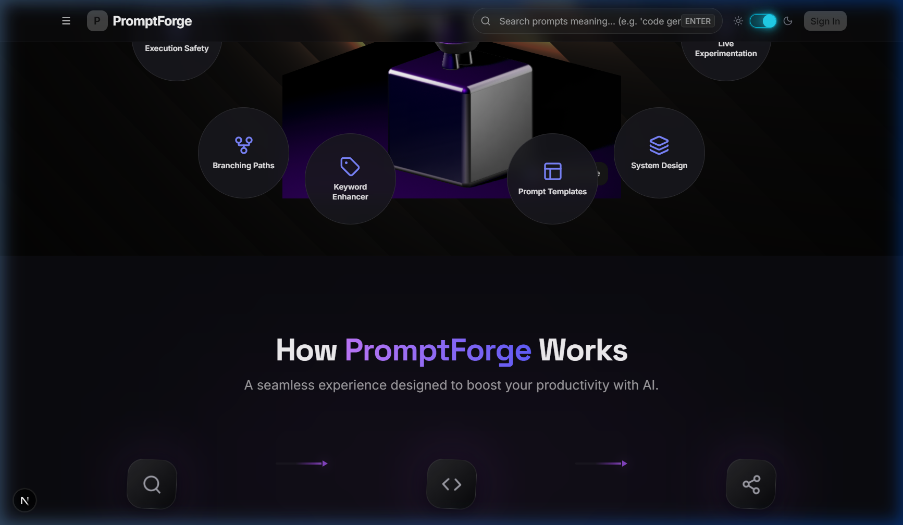
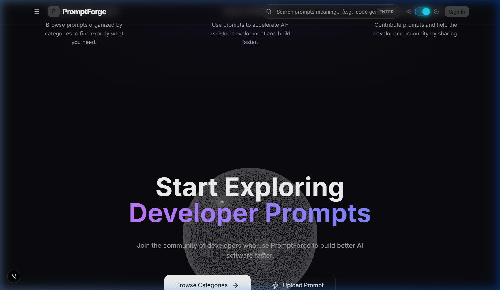
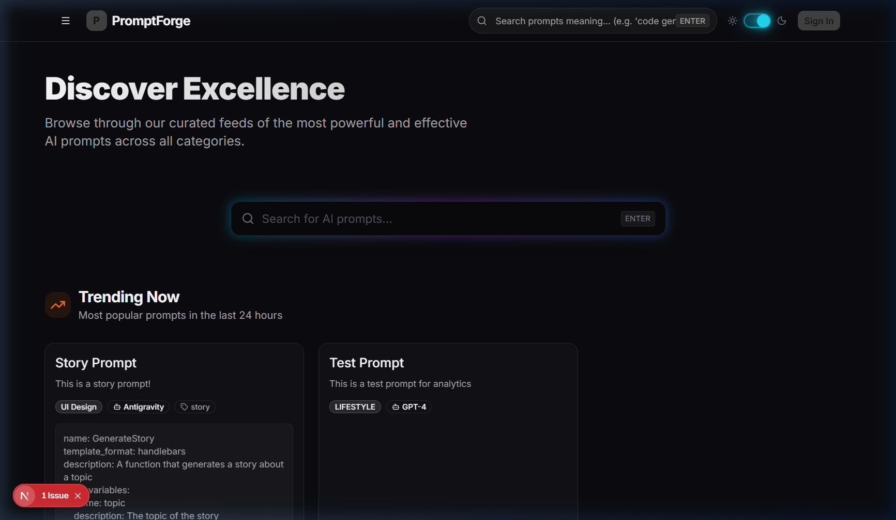
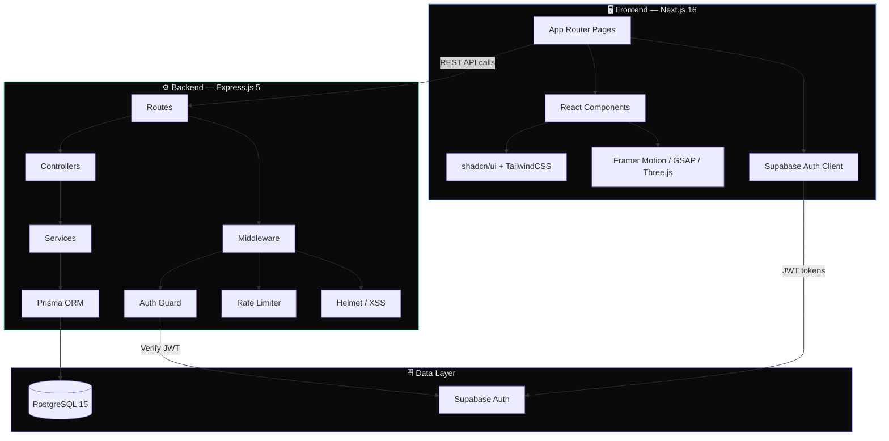
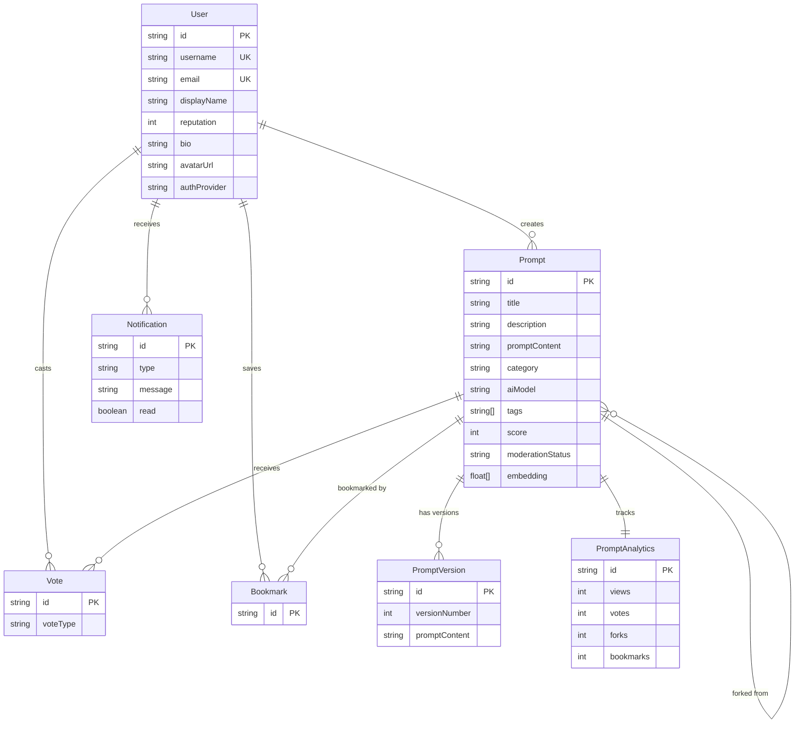
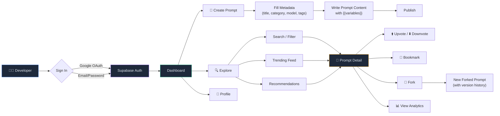

<p align="center">
  
</p>

<h1 align="center">⚡ PromptForge</h1>

<p align="center">
  <strong>The ultimate collaborative platform for prompt engineers and AI developers.</strong><br/>
  Discover, create, version, fork, and share high-performance AI prompts — all in one place.
</p>

<p align="center">
  <a href="#-features">Features</a> •
  <a href="#-screenshots">Screenshots</a> •
  <a href="#-tech-stack">Tech Stack</a> •
  <a href="#-architecture">Architecture</a> •
  <a href="#-getting-started">Getting Started</a> •
  <a href="#-api-reference">API Reference</a> •
  <a href="#-deployment">Deployment</a> •
  <a href="#-contributing">Contributing</a>
</p>

<p align="center">
  
  
  
  
  
  
</p>

---

## 🧠 What is PromptForge?

**PromptForge** is a full-stack, developer-focused platform where prompt engineers and AI developers can:

- 📝 **Create & Upload** structured AI prompts with metadata, tags, and variable placeholders
- 🔍 **Discover & Search** high-quality prompts through full-text search and smart recommendations
- 🍴 **Fork & Version** prompts with git-like branching, semantic versioning, and diff tracking
- ⬆️ **Vote & Bookmark** the best community prompts to surface top-quality content
- 📊 **Track Analytics** — views, votes, forks, and engagement metrics per prompt
- 👤 **Manage Profiles** with avatar generation, reputation scores, and activity tracking

> Think of it as **GitHub, but for AI Prompts.**

---

## ✨ Features

| Feature | Description |
| :--- | :--- |
| 🏗️ **Prompt Management** | Create, edit, and organize prompts with rich metadata (category, AI model, tags) |
| 🔀 **Forking & Versioning** | Fork any public prompt; track changes with semantic versions and a diff viewer |
| 🔎 **Smart Discovery** | Full-text search, trending feeds, personalized recommendations, and category filters |
| 🗳️ **Community Voting** | Upvote/downvote system with reputation scoring for creators |
| 🔖 **Bookmarks** | Save prompts for later with a personal bookmarks dashboard |
| 📈 **Prompt Analytics** | Real-time view counts, vote tallies, fork stats, and engagement metrics |
| 🔐 **Dual Authentication** | Google OAuth + email/password login via Supabase Auth |
| 🛡️ **Security Hardened** | Helmet headers, rate limiting, XSS sanitization, input validation, CORS |
| 🤖 **3D Interactive UI** | Spline 3D robot model, Three.js globe, particle animations on the landing page |
| 🌓 **Dark/Light Mode** | System-aware theme toggle with smooth transitions |
| 🐳 **Docker Ready** | One-command deployment with Docker Compose (Postgres + Backend + pgAdmin) |
| 📡 **Sentry Monitoring** | Full error tracking and performance monitoring on both frontend and backend |

---

## 📸 Screenshots

### Landing Page — Hero Section
> Interactive 3D robot model with animated gradient typography and CTA buttons.

<p align="center">
  
</p>

### Platform Features
> Clean card layout showcasing core capabilities — Discover, Structured Design, and Community Driven.

<p align="center">
  
</p>

### How It Works — Pipeline Flow
> Animated step-by-step pipeline showing the prompt lifecycle: Create → Validate → Share → Discover.

<p align="center">
  
</p>

### Prompt Categories
> Browse prompts by category — Code Generation, Creative Writing, Data Analysis, and more.

<p align="center">
  
</p>

### Explore & Discovery Page
> Trending prompts feed with search, filters, and real-time prompt cards.

<p align="center">
  
</p>

---

## 🏗️ Tech Stack

### Frontend
| Technology | Purpose |
| :--- | :--- |
| **Next.js 16** (App Router) | React framework with server components and file-based routing |
| **React 19** | UI component library |
| **TypeScript 5** | Type-safe development |
| **TailwindCSS 4** | Utility-first styling |
| **shadcn/ui** | Beautifully designed, accessible component primitives |
| **Framer Motion** | Declarative layout and scroll animations |
| **GSAP** | High-performance timeline animations |
| **Three.js / React Three Fiber** | 3D globe and WebGL effects |
| **Spline** | Interactive 3D robot model |
| **Recharts** | Dashboard and analytics charts |
| **Supabase JS** | Auth client and session management |
| **Sentry** | Frontend error tracking and performance |

### Backend
| Technology | Purpose |
| :--- | :--- |
| **Express.js 5** | REST API framework |
| **TypeScript** | Type-safe server code |
| **Prisma ORM** | Database access and migrations |
| **PostgreSQL 15** | Relational database |
| **Supabase Auth** | Google OAuth and JWT-based authentication |
| **Helmet** | Security headers |
| **express-rate-limit** | API rate limiting |
| **express-validator** | Request input validation |
| **xss-clean** | XSS attack prevention |
| **Morgan** | HTTP request logging |
| **Sentry** | Backend error tracking |
| **Docker** | Containerized deployment |

---

## 🏛️ Architecture

```
PromptForge follows a modern, layered full-stack architecture:
```



### Project Structure

```
prompt-book/
├── frontend/                # Next.js 16 App Router
│   ├── src/
│   │   ├── app/             # Pages & layouts (file-based routing)
│   │   │   ├── explore/     # Prompt discovery & trending feeds
│   │   │   ├── upload/      # Prompt creation form
│   │   │   ├── search/      # Full-text search results
│   │   │   ├── prompt/      # Individual prompt detail view
│   │   │   ├── profile/     # User profile & settings
│   │   │   ├── bookmarks/   # Saved prompts
│   │   │   ├── categories/  # Category-filtered browsing
│   │   │   ├── leaderboard/ # Top creators ranking
│   │   │   └── community/   # Community hub
│   │   ├── components/      # Reusable UI components
│   │   │   ├── sections/    # Landing page sections (hero, features, etc.)
│   │   │   ├── auth/        # Login, signup, OAuth components
│   │   │   ├── prompts/     # Prompt cards, detail views, editors
│   │   │   ├── upload/      # Multi-step upload wizard
│   │   │   ├── discovery/   # Trending, recommendations, search
│   │   │   ├── profile/     # Profile editing, avatar, stats
│   │   │   ├── navigation/  # Header, sidebar, mobile nav
│   │   │   └── ui/          # shadcn/ui base components + 3D models
│   │   └── lib/             # API services, utilities, Supabase client
│   └── public/              # Static assets
│
├── backend/                 # Express.js 5 REST API
│   └── src/
│       ├── routes/          # API endpoint definitions
│       ├── controllers/     # Request handlers
│       ├── services/        # Business logic layer
│       ├── middleware/       # Auth, rate-limit, security, validation
│       ├── config/          # Environment & app configuration
│       └── server.ts        # Application entry point
│
├── database/                # Data layer
│   └── prisma/
│       ├── schema.prisma    # Database schema (7 models)
│       └── migrations/      # Version-controlled schema changes
│
├── docs/                    # Documentation
│   ├── PRD.md               # Product Requirements Document
│   ├── architecture.md      # System architecture overview
│   ├── deployment.md        # Deployment guide
│   └── screenshots/         # App screenshots for README
│
├── docker-compose.yml       # Full-stack Docker orchestration
└── .env.example             # Environment variable template
```

---

## 📊 Database Schema

The platform uses **7 Prisma models** to manage all data:



---

## 🚀 Getting Started

### Prerequisites

- **Node.js** ≥ 18
- **PostgreSQL** 15+ (or use Docker)
- **npm** or **yarn**
- A **Supabase** project (for authentication)

### 1. Clone the Repository

```bash
git clone https://github.com/Vishallakshmikanthan/prompt-forge.git
cd prompt-forge
```

### 2. Environment Setup

Copy the example environment file and fill in your credentials:

```bash
cp .env.example .env
```

| Variable | Description |
| :--- | :--- |
| `DATABASE_URL` | PostgreSQL connection string |
| `JWT_SECRET` | Secret key for JWT signing (min 32 chars) |
| `NEXT_PUBLIC_API_URL` | Backend API URL (default: `http://localhost:4000/api`) |
| `NEXT_PUBLIC_SUPABASE_URL` | Your Supabase project URL |
| `NEXT_PUBLIC_SUPABASE_ANON_KEY` | Your Supabase anonymous key |

### 3. Database Setup

**Option A: Using Docker** (recommended)

```bash
docker-compose up -d postgres
```

**Option B: Local PostgreSQL**

Create a database named `promptforge_db` and update `DATABASE_URL` in `.env`.

Then run migrations:

```bash
cd database
npx prisma generate
npx prisma migrate deploy
```

### 4. Start the Backend

```bash
cd backend
npm install
npm run dev
```

The API server will start at `http://localhost:4000`. Verify with:

```bash
curl http://localhost:4000/api/health
```

### 5. Start the Frontend

```bash
cd frontend
npm install
npm run dev
```

The app will be available at `http://localhost:3000`.

---

## 📡 API Reference

The backend exposes a RESTful API at `/api`. Here's a summary of the available endpoints:

| Module | Endpoint | Description |
| :--- | :--- | :--- |
| **Auth** | `POST /api/auth/register` | Register with email/password |
| | `POST /api/auth/login` | Login and receive JWT |
| **Prompts** | `GET /api/prompts` | List all prompts (paginated) |
| | `POST /api/prompts` | Create a new prompt |
| | `GET /api/prompts/:id` | Get prompt details |
| | `PUT /api/prompts/:id` | Update a prompt |
| | `DELETE /api/prompts/:id` | Delete a prompt |
| **Search** | `GET /api/search` | Full-text search across prompts |
| **Discovery** | `GET /api/discovery/trending` | Get trending prompts |
| | `GET /api/discovery/categories` | Browse by category |
| **Recommendations** | `GET /api/recommendations/similar/:id` | Similar prompts |
| | `GET /api/recommendations/personalized` | Personalized feed |
| **Forking** | `POST /api/forks/:id` | Fork an existing prompt |
| **Versions** | `GET /api/versions/:promptId` | Get version history |
| **Votes** | `POST /api/prompts/:id/vote` | Vote on a prompt |
| **Bookmarks** | `POST /api/bookmarks/:id` | Bookmark a prompt |
| | `GET /api/bookmarks` | Get user's bookmarks |
| **Analytics** | `GET /api/analytics/:promptId` | Get prompt analytics |
| **Users** | `GET /api/users/:id` | Get user profile |
| | `PUT /api/users/:id` | Update profile |
| **Notifications** | `GET /api/notifications` | Get user notifications |

> 🔒 Endpoints marked with authentication require a valid JWT in the `Authorization: Bearer <token>` header.

---

## 🐳 Deployment

### Docker Compose (Recommended)

Spin up the entire stack with one command:

```bash
docker-compose up --build -d
```

This starts:
- **PostgreSQL 15** on port `5433`
- **Backend API** on port `4000`
- **pgAdmin** on port `5050` (admin@promptforge.com / admin123)

### Manual Deployment

#### Backend
```bash
cd backend
npm run build
npm run start
```

#### Frontend
```bash
cd frontend
npm run build
npm run start
```

For detailed deployment instructions, see [docs/deployment.md](docs/deployment.md).

---

## 🔄 Application Flow



---

## 🤝 Contributing

Contributions are welcome! Here's how to get started:

1. **Fork** the repository
2. **Create** a feature branch: `git checkout -b feature/amazing-feature`
3. **Commit** your changes: `git commit -m 'Add amazing feature'`
4. **Push** to the branch: `git push origin feature/amazing-feature`
5. **Open** a Pull Request

### Development Guidelines

- Follow the existing TypeScript patterns and naming conventions
- Use Prisma for all database operations (no raw SQL)
- Add proper error handling with `next(error)` middleware pattern
- Keep API responses consistent using the standard response format
- Test your changes locally before submitting

---

## 📄 License

This project is open source and available under the [MIT License](LICENSE).

---

<p align="center">
  Built with ❤️ by <a href="https://github.com/Vishallakshmikanthan">Vishallakshmikanthan</a>
</p>
