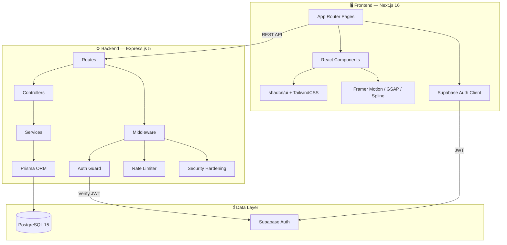
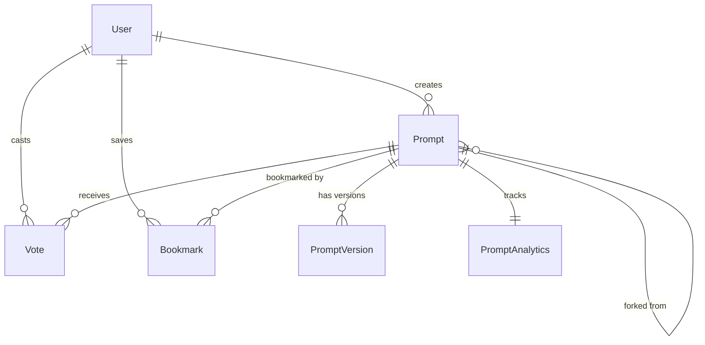

<p align="center">
  
</p>

<h1 align="center">⚡ PromptForge</h1>

<p align="center">
  <strong>The ultimate collaborative platform for prompt engineers and AI developers.</strong><br/>
  Discover, create, version, fork, and share high-performance AI prompts — all in one place.
</p>

<p align="center">
  <a href="#-ideology">Ideology</a> •
  <a href="#-design-inspirations">Design</a> •
  <a href="#-tech-stack">Tech Stack</a> •
  <a href="#-architecture">Architecture</a> •
  <a href="#-working-flows">Workflows</a> •
  <a href="#-database-design">Database</a> •
  <a href="#-getting-started">Getting Started</a>
</p>

<p align="center">
  
  
  
  
  
  
</p>

---

> [!IMPORTANT]
> **🚧 Under Development:** PromptForge is currently in active development. While the core features are functional and you can start sharing your prompts today, expect frequent updates and new capabilities!

---

## 🧠 Ideology

**PromptForge** is born from the belief that prompts are the code of the Generative AI era. Just as developers need GitHub to collaborate on traditional software, prompt engineers need a specialized platform to:

- **Treat Prompts as Assets:** Instead of ephemeral text, prompts should be structured, versioned, and measurable.
- **Democratize Quality:** By sharing and forking prompts, the community can collectively refine the "best" ways to interact with LLMs.
- **Bridge the Gap:** Bringing together technical AI developers and creative prompt designers in a unified workspace.

---

## ✨ Design Inspirations

PromptForge aims for a **Premium, State-of-the-Art** aesthetic that feels as advanced as the AI it supports.

### Core Design Principles:
- **Glassmorphism & Depth:** Using blurred surfaces and subtle shadows to create a modern, layered feel.
- **Dynamic Interaction:** Leveraging **Framer Motion** and **GSAP** for micro-animations that make the UI feel alive.
- **3D Immersion:** Integrating **Spline** 3D models and **Three.js** (React Three Fiber) to provide a rich, tactile experience.
- **Glow & Vibrancy:** Custom HSL color palettes with neon accents against a sleek dark mode.
- **Premium Typography:** Using modern, clean typefaces (e.g., Inter/Outfit) to ensure readability and a high-end look.

---

## 🏗️ Tech Stack

### Frontend
| Technology | Purpose |
| :--- | :--- |
| **Next.js 16** (App Router) | React framework with server components and file-based routing |
| **React 19** | UI component library |
| **TailwindCSS 4** | Utility-first styling with modern CSS features |
| **shadcn/ui** | Accessible, beautifully designed component primitives |
| **Framer Motion** | Declarative layout and scroll-linked animations |
| **GSAP** | High-performance timeline-based animations |
| **Spline** | Interactive 3D robot model on the landing page |
| **Three.js / R3F** | 3D globe and WebGL background effects |
| **Lenis** | Smooth, high-performance scrolling |
| **Supabase Client** | Auth management and session handling |

### Backend
| Technology | Purpose |
| :--- | :--- |
| **Express.js 5** | High-performance REST API framework |
| **Prisma ORM** | Type-safe database access and migrations |
| **PostgreSQL 15** | Reliable relational database storage |
| **Supabase Auth** | Google OAuth + Email/Password JWT-based auth |
| **Helmet / XSS-Clean** | Essential security headers and sanitization |
| **Sentry** | Full-stack error tracking and performance monitoring |

---

## 🏛️ Architecture

PromptForge follows a layered architecture to ensure scalability and maintainability.



---

## 🔄 Working Flows (Prompt Lifecycle)

1. **Discovery:** Users browse trending or category-filtered prompts using the high-performance search and recommendation engine.
2. **Analysis:** Detailed prompt views show engagement metrics (views, forks, votes) and version history.
3. **Refinement:** Users can **Fork** any public prompt, creating a copy they can modify and iterate on.
4. **Creation:** A multi-step upload wizard allows for structured prompt design, including meta-tags and variable placeholders.
5. **Versioning:** Every change is tracked. Users can revisit previous versions or see exactly what changed via the diff viewer.

---

## 📊 Database Design

Our schema is designed for relational integrity and fast discovery.

### Core Data Structures:
- **`User`**: Tracks reputation, profile details, and authentication linking.
- **`Prompt`**: The central entity, containing content, metadata, and linkage to its "Parent" (for forking lineage).
- **`PromptVersion`**: A snapshot of a prompt at a specific point in time.
- **`Analytics`**: Separated metrics for high-frequency updates without locking core tables.
- **`Vote` / `Bookmark` / `Fork`**: Relational tables managing community interaction.



---

## 🚀 Getting Started

### Prerequisites
- **Node.js** ≥ 18
- **PostgreSQL** 15+ (Local or via Docker)
- **Supabase** Project (for Auth)

### Setup
1. **Clone & Install:**
   ```bash
   git clone https://github.com/Vishallakshmikanthan/prompt-forge.git
   npm install # in both frontend and backend directories
   ```
2. **Environment:**
   Create a `.env` file in the root using `.env.example` as a template.
3. **Database:**
   ```bash
   cd database
   npx prisma generate
   npx prisma migrate dev
   ```
4. **Run:**
   - **Backend:** `npm run dev` (Port 4000)
   - **Frontend:** `npm run dev` (Port 3000)

---

<p align="center">
  Built with ❤️ by <a href="https://github.com/Vishallakshmikanthan">Vishallakshmikanthan</a>
</p>
